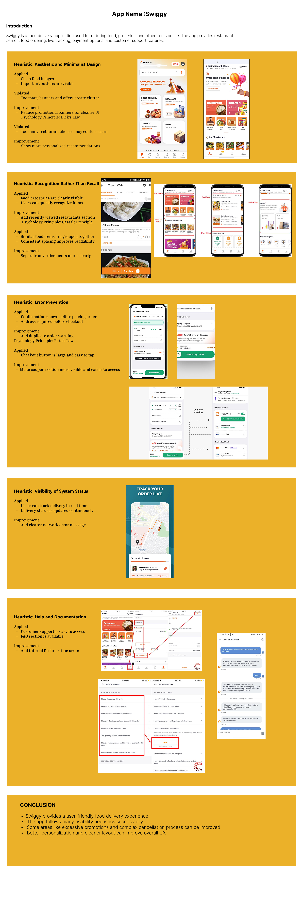

# Usability Heuristics and Psychology

This assignment analyzes UI design using Nielsen's Usability Heuristics and Psychology Principles.

## Tools Used
- Figma
- Usability Heuristics
- UI Psychology

## Live Prototype
https://www.figma.com/proto/6ANalhvkmPYaGUn3PF2RbX/Usability-Heuristics-and-Psychology-in-UI-Design-Analysis?node-id=1-2&p=f&t=3TtZ4APuIjIljzIP-1&scaling=scale-down&content-scaling=fixed&page-id=0%3A1

## Preview

